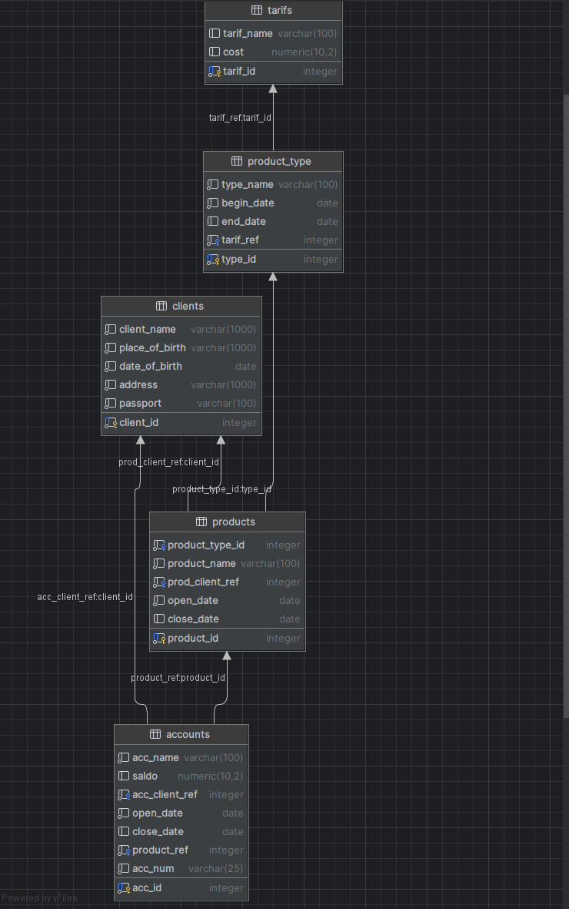

# Тестовое задание: Модель учета операций в Банке

## Описание проекта

Данный проект представляет собой упрощенную модель учета операций в банковской системе. Реализована реляционная база данных PostgreSQL для управления клиентами, продуктами, счетами и операциями по счетам.

## Структура базы данных

### Таблицы и связи:

1. **clients** - информация о клиентах банка
2. **tarifs** - тарифы за операции по счетам
3. **product_type** - типы продуктов (КРЕДИТ, ДЕПОЗИТ, КАРТА)
4. **products** - открытые продукты клиентов
5. **accounts** - счета, открытые для продуктов
6. **records** - операции по счетам

### Схема связей:
```

```

## Требования

- **СУБД**: PostgreSQL 17+
- **Доступ**: Базовые знания SQL

## Инструкция по развертыванию

### 1. Создание структуры базы данных

```sql

DROP TABLE IF EXISTS tarifs CASCADE;
DROP TABLE IF EXISTS product_type CASCADE;
DROP TABLE IF EXISTS accounts CASCADE;
DROP TABLE IF EXISTS records CASCADE;
DROP TABLE IF EXISTS clients CASCADE;
DROP TABLE IF EXISTS products CASCADE;

CREATE TABLE clients (
    client_id INTEGER PRIMARY KEY ,
    client_name VARCHAR(1000) NOT NULL,
    place_of_birth VARCHAR(1000) NOT NULL,
    date_of_birth DATE NOT NULL CHECK (date_of_birth <= CURRENT_DATE),
    address VARCHAR(1000) NOT NULL,
    passport VARCHAR(100) NOT NULL
);

CREATE TABLE tarifs(
    tarif_id INTEGER PRIMARY KEY,
    tarif_name VARCHAR(100),
    cost NUMERIC(10, 2)
);

CREATE TABLE product_type(
    type_id  INTEGER PRIMARY KEY ,
    type_name VARCHAR(100) NOT NULL DEFAULT 'ДЕПОЗИТ' CHECK ( type_name IN ('ДЕПОЗИТ', 'КРЕДИТ','КАРТА')),
    begin_date DATE NOT NULL,
    end_date DATE,
    tarif_ref INTEGER NOT NULL,
    FOREIGN KEY (tarif_ref) REFERENCES tarifs(tarif_id)
);

CREATE TABLE products (
    product_id INTEGER PRIMARY KEY,
    product_type_id INTEGER NOT NULL,
    product_name VARCHAR(100) NOT NULL ,
    prod_client_ref INTEGER NOT NULL,
    open_date DATE NOT NULL,
    close_date DATE,
    FOREIGN KEY (product_type_id) REFERENCES product_type(type_id),
    FOREIGN KEY (prod_client_ref) REFERENCES clients(client_id)
);


CREATE TABLE accounts(
    acc_id INTEGER PRIMARY KEY ,
    acc_name VARCHAR(100) NOT NULL,
    saldo NUMERIC(10, 2) DEFAULT NULL,
    acc_client_ref INTEGER NOT NULL,
    open_date DATE NOT NULL,
    close_date DATE,
    product_ref INTEGER NOT NULL,
    acc_num VARCHAR(25) NOT NULL,
    FOREIGN KEY (acc_client_ref) REFERENCES clients(client_id),
    FOREIGN KEY (product_ref) REFERENCES products(product_id)
);

CREATE TABLE records (
    records_id INTEGER PRIMARY KEY ,
    dt INTEGER NOT NULL CHECK ( dt IN (0,1)),
    sum NUMERIC(10, 2) DEFAULT NULL,
    acc_ref INTEGER NOT NULL,
    oper_date DATE NOT NULL,
    FOREIGN KEY (acc_ref) REFERENCES accounts(acc_id)
);
```

### 2. Наполнение тестовыми данными

```sql

insert into tarifs values (1,'Тариф за выдачу кредита', 10);
insert into tarifs values (2,'Тариф за открытие счета', 10);
insert into tarifs values (3,'Тариф за обслуживание карты', 10);

insert into product_type values (1, 'КРЕДИТ', to_date('01.01.2018','DD.MM.YYYY'), null, 1);
insert into product_type values (2, 'ДЕПОЗИТ', to_date('01.01.2018','DD.MM.YYYY'), null, 2);
insert into product_type values (3, 'КАРТА', to_date('01.01.2018','DD.MM.YYYY'), null, 3);

insert into clients values (1, 'Сидоров Иван Петрович', 'Россия, Московская облать, г. Пушкин', to_date('01.01.2001','DD.MM.YYYY'), 'Россия, Московская облать, г. Пушкин, ул. Грибоедова, д. 5', '2222 555555, выдан ОВД г. Пушкин, 10.01.2015');
insert into clients values (2, 'Иванов Петр Сидорович', 'Россия, Московская облать, г. Клин', to_date('01.01.2001','DD.MM.YYYY'), 'Россия, Московская облать, г. Клин, ул. Мясникова, д. 3', '4444 666666, выдан ОВД г. Клин, 10.01.2015');
insert into clients values (3, 'Петров Сиодр Иванович', 'Россия, Московская облать, г. Балашиха', to_date('01.01.2001','DD.MM.YYYY'), 'Россия, Московская облать, г. Балашиха, ул. Пушкина, д. 7', '4444 666666, выдан ОВД г. Клин, 10.01.2015');

insert into products values (1, 1, 'Кредитный договор с Сидоровым И.П.', 1, to_date('01.06.2015','DD.MM.YYYY'), null);
insert into products values (2, 2, 'Депозитный договор с Сидоровым И.П.', 2, to_date('01.08.2017','DD.MM.YYYY'), null);
insert into products values (3, 3, 'Карточный договор с Сидоровым И.П.', 3, to_date('01.08.2017','DD.MM.YYYY'), null);
--task2
insert into products values (4, 2, 'Депозитный договор с Сидоровым И.П.', 2, to_date('01.10.2017','DD.MM.YYYY'), null);

insert into accounts values (1, 'Кредитный счет для Сидорова И.П.', -2000, 1, to_date('01.06.2015','DD.MM.YYYY'), null, 1, '45502810401020000022');
insert into accounts values (2, 'Депозитный счет для Сидорова И.П.', 6000, 2, to_date('01.08.2017','DD.MM.YYYY'), null, 2, '42301810400000000001');
insert into accounts values (3, 'Карточный счет для Сидорова И.П.', 8000, 3, to_date('01.08.2017','DD.MM.YYYY'), null, 3, '40817810700000000001');
--task4
insert into accounts values (4, 'Депозитный счет для Сидорова И.П.', 6000, 2, to_date('01.10.2017','DD.MM.YYYY'), null, 2, '43301810400000000001');

insert into records values (1, 1, 5000, 1, to_date('01.06.2015','DD.MM.YYYY'));
insert into records values (2, 0, 1000, 1, to_date('01.07.2015','DD.MM.YYYY'));
insert into records values (3, 0, 2000, 1, to_date('01.08.2015','DD.MM.YYYY'));
insert into records values (4, 0, 3000, 1, to_date('01.09.2015','DD.MM.YYYY'));
insert into records values (5, 1, 5000, 1, to_date('01.10.2015','DD.MM.YYYY'));
insert into records values (6, 0, 3000, 1, to_date('01.10.2015','DD.MM.YYYY'));

insert into records values (7, 0, 10000, 2, to_date('01.08.2017','DD.MM.YYYY'));

insert into records values (8, 1, 1000, 2, to_date('05.08.2017','DD.MM.YYYY'));
insert into records values (9, 1, 2000, 2, to_date('21.09.2017','DD.MM.YYYY'));
insert into records values (10, 1, 5000, 2, to_date('24.10.2017','DD.MM.YYYY'));
insert into records values (11, 0, 6000, 2, to_date('26.11.2017','DD.MM.YYYY'));

insert into records values (12, 0, 120000, 3, to_date('08.09.2017','DD.MM.YYYY'));
insert into records values (13, 1, 1000, 3, to_date('05.10.2017','DD.MM.YYYY'));
insert into records values (14, 1, 2000, 3, to_date('21.10.2017','DD.MM.YYYY'));
insert into records values (15, 1, 5000, 3, to_date('24.10.2017','DD.MM.YYYY'));
insert into records values (16, 0, 100, 2, to_date('01.08.2017','DD.MM.YYYY'));
insert into records values (17, 0, 80000, 3, to_date('01.08.2017','DD.MM.YYYY'));
insert into records values (18, 0, 8000, 3, to_date('01.08.2017','DD.MM.YYYY'));
insert into records values (19, 0, 10000, 2, to_date('01.08.2017','DD.MM.YYYY'));
insert into records values (20, 0, 10000, 2, to_date('01.08.2017','DD.MM.YYYY'));
insert into records values (21, 1, 10000, 2, to_date('01.08.2017','DD.MM.YYYY'));
insert into records values (22, 1, 100, 2, to_date('01.08.2017','DD.MM.YYYY'));
insert into records values (23, 0, 10000, 3, to_date('01.08.2017','DD.MM.YYYY'));
insert into records values (24, 0, 10000, 3, to_date('01.08.2017','DD.MM.YYYY'));
insert into records values (25, 1, 10000, 3, to_date('01.08.2017','DD.MM.YYYY'));
insert into records values (26, 1, 100, 3, to_date('01.08.2017','DD.MM.YYYY'));
insert into records values (27, 1, 100000, 3, to_date('01.08.2017','DD.MM.YYYY'));

--Task 5
INSERT INTO products VALUES (5, 1, 'Кредитный договор с Ивановым П.С.', 2, '2023-01-01', NULL);

INSERT INTO accounts VALUES (5, 'Кредитный счет для Иванова П.С.', -5000, 2, '2023-01-01', NULL, 5, '45502810401020000023');

INSERT INTO records VALUES (28, 1, 10000, 5, to_date('01.01.2023','DD.MM.YYYY'));

INSERT INTO records VALUES (29, 0, 100, 5, to_date('01.01.2023','DD.MM.YYYY'));
```

## Выполненные задания

### Задание 3: Отчет по депозитным счетам
```sql
SELECT
    c.client_id,
    c.client_name,
    p.product_id,
    p.product_name,
    a.acc_id,
    a.acc_name,
    a.saldo,
    a.open_date
FROM clients c
JOIN products p ON c.client_id = p.prod_client_ref
JOIN accounts a ON p.product_id = a.product_ref
JOIN product_type pt ON p.product_type_id = pt.type_id
WHERE pt.type_name = 'ДЕПОЗИТ'
    AND p.close_date IS NULL AND c.client_id IN(
        SELECT prod_client_ref FROM products
        WHERE close_date IS NULL
        GROUP BY prod_client_ref
        HAVING COUNT (*) > 1
        )
ORDER BY c.client_id, a.open_date;
```

### Задание 4: Счета с операциями внесения средств
```sql
SELECT
    a.acc_id,
    a.acc_name,
    a.acc_num,
    pt.type_name,
    r.sum,
    r.oper_date
FROM accounts a
JOIN products p ON a.product_ref = p.product_id
JOIN product_type pt ON p.product_type_id = pt.type_id
JOIN records r ON a.acc_id = r.acc_ref
WHERE pt.type_name IN ('ДЕПОЗИТ','КАРТА')
  AND r.dt = 0 AND r.oper_date = '01.08.2017'
ORDER BY a.acc_id;

```

### Задание 5: Клиенты с непогашенными кредитами
```sql
SELECT
    c.client_id,
    c.client_name,
    p.product_name,
    p.open_date,
    a.acc_num,
    SUM(CASE WHEN r.dt=1 THEN r.sum ELSE 0 END) as total_debit,
    SUM(CASE WHEN r.dt=0 THEN r.sum ELSE 0 END) as total_credit
FROM clients c
JOIN products p ON c.client_id = p.prod_client_ref
JOIN accounts a on p.product_id = a.product_ref
JOIN records r on a.acc_id = r.acc_ref
JOIN product_type pt on p.product_type_id = pt.type_id
WHERE pt.type_name = ('КРЕДИТ') AND p.close_date IS NULL
GROUP BY c.client_id, c.client_name,
    p.product_name,
    p.open_date,
    a.acc_num
HAVING SUM(CASE WHEN r.dt=0 THEN r.sum ELSE 0 END) <
    SUM(CASE WHEN r.dt=1 THEN r.sum ELSE 0 END);
```

## Как тестировать решения

### Шаг 1: Проверка структуры
```sql
-- Проверьте, что все таблицы созданы
SELECT table_name FROM information_schema.tables 
WHERE table_schema = 'public' ORDER BY table_name;
```

### Шаг 2: Проверка данных
```sql
-- Убедитесь, что данные загружены
SELECT 
    (SELECT COUNT(*) FROM clients) as clients_count,
    (SELECT COUNT(*) FROM products) as products_count,
    (SELECT COUNT(*) FROM accounts) as accounts_count,
    (SELECT COUNT(*) FROM records) as records_count;
```

### Шаг 3: Выполнение заданий

task 3
| client\_id | client\_name | product\_id | product\_name | acc\_id | acc\_name | saldo | open\_date |
| :--- | :--- | :--- | :--- | :--- | :--- | :--- | :--- |
| 2 | Иванов Петр Сидорович | 2 | Депозитный договор с Сидоровым И.П. | 2 | Депозитный счет для Сидорова И.П. | 6000.00 | 2017-08-01 |
| 2 | Иванов Петр Сидорович | 2 | Депозитный договор с Сидоровым И.П. | 4 | Депозитный счет для Сидорова И.П. | 6000.00 | 2017-10-01 |


task4
   | acc\_id | acc\_name | acc\_num | type\_name | sum | oper\_date |
| :--- | :--- | :--- | :--- | :--- | :--- |
| 2 | Депозитный счет для Сидорова И.П. | 42301810400000000001 | ДЕПОЗИТ | 10000.00 | 2017-08-01 |
| 2 | Депозитный счет для Сидорова И.П. | 42301810400000000001 | ДЕПОЗИТ | 100.00 | 2017-08-01 |
| 2 | Депозитный счет для Сидорова И.П. | 42301810400000000001 | ДЕПОЗИТ | 10000.00 | 2017-08-01 |
| 2 | Депозитный счет для Сидорова И.П. | 42301810400000000001 | ДЕПОЗИТ | 10000.00 | 2017-08-01 |
| 3 | Карточный счет для Сидорова И.П. | 40817810700000000001 | КАРТА | 10000.00 | 2017-08-01 |
| 3 | Карточный счет для Сидорова И.П. | 40817810700000000001 | КАРТА | 10000.00 | 2017-08-01 |
| 3 | Карточный счет для Сидорова И.П. | 40817810700000000001 | КАРТА | 80000.00 | 2017-08-01 |
| 3 | Карточный счет для Сидорова И.П. | 40817810700000000001 | КАРТА | 8000.00 | 2017-08-01 |


task5
| client\_id | client\_name | product\_name | open\_date | acc\_num | total\_debit | total\_credit |
| :--- | :--- | :--- | :--- | :--- | :--- | :--- |
| 1 | Сидоров Иван Петрович | Кредитный договор с Сидоровым И.П. | 2015-06-01 | 45502810401020000022 | 10000 | 9000 |
| 2 | Иванов Петр Сидорович | Кредитный договор с Ивановым П.С. | 2023-01-01 | 45502810401020000023 | 10000 | 100 |


